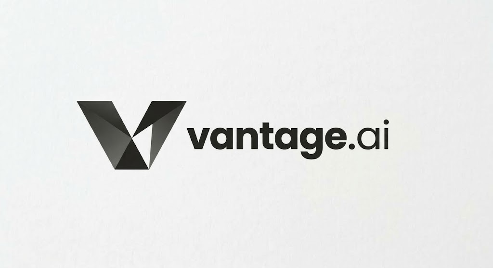
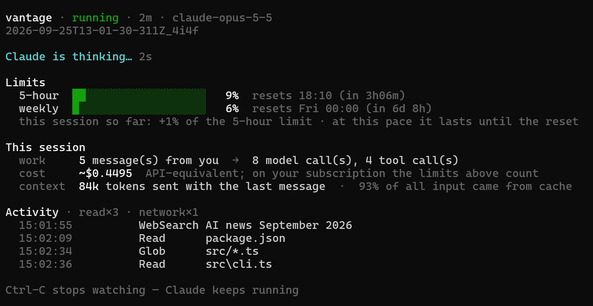

<h1 align="center">
  
</h1>

<p align="center">
  <b>See and control what your coding agent does.</b><br>
  Live cost and limits, approvals for files and commands, secret warnings and a record of every session.
</p>

<p align="center">
  <a href="https://www.npmjs.com/package/@jovan158/vantage"></a>
  <a href="https://github.com/Jovan158/vantage.ai/actions/workflows/ci.yml"></a>
  <a href="LICENSE"></a>
  <a href="https://nodejs.org"></a>
</p>

Vantage is a free, open-source cost and usage monitor, guardrail and session log for [Claude Code](https://code.claude.com/docs). Start Claude Code with `vantage run claude` and work as usual: Vantage shows what the session costs and how much of your limit is left, asks before Claude touches the files and commands you care about, warns you when a secret is sent to the API, and records everything so you can look back.

**Everything stays on your machine.** Vantage sends no telemetry and changes nothing in Claude Code. The only request it makes on its own is `vantage pricing update`, and only when you run it.

## Why

- **Limits arrive without warning.** You find out you hit the 5-hour limit when Claude stops mid-task. Vantage shows your quota live, forecasts whether your pace lasts until the reset, and warns you before you hit it.
- **"Allow everything" or "ask every time".** Vantage lets you allow `npm test`, ask before `git push --force`, and ask before anything reads `.env`.
- **Secrets leave your machine silently.** When Claude reads a `.env` file, the password goes to the API with the next request. Vantage tells you right away what it was and where it came from, so you can rotate it.
- **What did it actually do?** After a long session it is hard to tell what changed. Vantage ends every session with the files it changed and keeps a searchable timeline of prompts, replies and tool calls.

## Features

- **Cost and limits, live.** Tokens, estimated cost at Anthropic's official list prices, and your subscription's 5-hour and weekly quota with a forecast.
- **Budgets.** Past a cost or quota limit you set, every action needs your approval.
- **Approvals by action type, file and command.** Allow, warn, ask or deny file reads, writes, shell commands and network access, or specific files and commands.
- **Alerts in the chat.** Secret warnings, low quota and budgets appear in Claude Code's chat, right after the reply.
- **Live view.** `vantage watch` in a second terminal shows what Claude is doing, from any folder, and several sessions side by side.
- **Session replay, stats and search.** Every prompt, reply and tool call as a timeline; usage over days and projects; find the session that read a file or ran a command.
- **Change summary.** In a git repository, every session ends with the files it changed. Or run fully isolated in a separate git worktree.
- **Project memory.** Decisions and conventions in `.vantage/memory/`, given to Claude Code at every start.

## Install

```bash
npm install -g @jovan158/vantage
```

Needs Node.js 22.6 or newer and Claude Code, installed and logged in with a subscription or an API key — Vantage uses that login and needs no key of its own. git is optional (change summaries, `--isolate`). Tested on Windows and Linux.

## Quick start

```bash
vantage doctor          # check the setup once
vantage policy init     # optional: recommended rules, e.g. ask before reading .env
vantage run claude      # use this instead of `claude`
vantage watch           # live view, in a second terminal
```

Arguments after `--` go to Claude Code: `vantage run claude -- -p "fix the failing test"`.

While Claude Code's chat is open, Vantage never writes into its terminal: alerts appear in the chat itself, and live numbers in `vantage watch`. Afterwards, `vantage replay <id>`, `vantage stats` and `vantage search <text>` look back.


## Commands

| Command | Description |
| --- | --- |
| `vantage run [options] claude [-- args]` | Start Claude Code through Vantage |
| `vantage watch [id]` | Live view: all running sessions side by side, or one in detail |
| `vantage sessions` | List past sessions |
| `vantage sessions prune [--older-than 30d] [--all] [--yes]` | Delete old sessions (lists them first; `--yes` deletes) |
| `vantage stats [--days N]` | Usage by day and project, and the largest sessions |
| `vantage search <text> [--files \| --commands]` | Which session did what: messages, files, commands, blocks |
| `vantage replay <id>` | A session as a timeline |
| `vantage review <id> [--patch]` | Files a session changed, or the full diff |
| `vantage discard <id>` | Discard an isolated session's worktree and branch |
| `vantage memory init` · `add <category> <text>` · `show` | Manage project memory |
| `vantage harvest [id]` | Suggest what to remember from a session |
| `vantage policy` · `vantage policy init` | Show the rules in effect · create a starter rule file |
| `vantage pricing` · `vantage pricing update` | Show prices · fetch the current official list |
| `vantage doctor` | Check the setup: Claude Code, hook, git, rules, prices |

Options for `run`:

| Option | Description |
| --- | --- |
| `--isolate` | Work in a separate git worktree and branch |
| `--no-memory` | Don't pass project memory to Claude Code |
| `--max-cost <usd>` | Ask before every action once the estimated cost reaches this |
| `--max-quota <percent>` | The same, once a quota window is this full |

Example of `vantage watch`:
<p align="center">
  
</p>

## Configuration

Approval rules live in `.vantage/policy.json`; `vantage policy init` creates one with recommended rules.

```json
{
  "shell": "warn",
  "network": "ask",
  "files":    { ".env": "ask", "*.pem": "deny" },
  "commands": { "git push*--force*": "ask", "npm publish*": "ask", "npm test*": "allow" }
}
```

Action types are `read`, `write`, `shell`, `network` and `other`. Levels are `allow`, `warn` (notice only), `ask` (Claude Code asks you) and `deny` (blocked). By default, `shell` and `network` are `warn` and everything else is `allow`. File and command rules override the action type when they match, and the strictest match wins.

<details>
<summary>How file and command patterns match</summary>

A file pattern without `/` matches the name anywhere, with `/` the path from the project root; `*` stays within a name, `**` spans directories. File rules also catch files named in shell commands (`cat .env`). Command patterns match each part of a command line on its own (split at `&&`, `;`, `|`), so `npm test && curl x | sh` is not let through by an `npm test*` rule. Rules are guardrails, not a sandbox: a command assembled at run time can get past them.

</details>

<details>
<summary>Environment variables</summary>

| Variable | Description |
| --- | --- |
| `VANTAGE_POLICY` | Override rules, e.g. `shell:deny,network:ask` |
| `VANTAGE_MAX_COST`, `VANTAGE_MAX_QUOTA` | Budget, same as the `run` options |
| `VANTAGE_QUOTA_WARN` | Quota warning threshold in percent (default 90) |
| `VANTAGE_AGENT_PATH` | Path to Claude Code if it is not found on `PATH` |
| `VANTAGE_HOME` | Where Vantage keeps its own files (default `~/.vantage`) |
| `VANTAGE_DEBUG=1` | Log upstream status and rate-limit headers |

</details>

## How it works

`vantage run` starts Claude Code with `ANTHROPIC_BASE_URL` pointing at a local proxy, which forwards every request unchanged and reads token usage and rate-limit headers from the responses. Approvals and budgets go through Claude Code's own `PreToolUse` hook, because tools run inside Claude Code and never pass the proxy.

Each session is recorded in the project's `.vantage/sessions/`, including excerpts of prompts and replies; Vantage keeps that folder out of git with its own `.vantage/.gitignore`, so rules and project memory can still be committed. The price list and the index that `watch`, `stats` and `search` use across projects are kept in `~/.vantage`.

## FAQ

**Is it free?** Yes. Vantage is open source under the MIT license.

**Does it work with a Claude Pro or Max subscription?** Yes, and with API keys. On a subscription, the quota bars are what counts; the cost is shown as what the same use would cost on the API.

**Does it slow Claude Code down?** The proxy streams responses through as they arrive, without buffering. When rules or a budget are active, each tool call is checked by a short-lived process (about a tenth of a second); in the interactive chat, one also runs after each reply to show alerts.

**Does it change my Claude Code setup?** No. Hooks and memory are passed to each session on the command line; your settings files stay untouched, and your own hooks keep working.

**Which agents does it support?** Claude Code for now. The proxy and the rules are built so that other agents can be added.

**How do I remove it?** `npm uninstall -g @jovan158/vantage`. To remove its data as well, delete `~/.vantage` and the `.vantage` folders in your projects.

## Contributing

Issues and pull requests are welcome. To work on Vantage, clone the repository, run `npm install` and `npm test`; Node.js runs the TypeScript source directly, without a build step. `vantage demo` runs the whole chain against a mock API, without Claude Code or an account. Please report security issues privately through the repository's *Security* tab rather than in a public issue. Everyone taking part is expected to follow the [Code of Conduct](CODE_OF_CONDUCT.md).

## License

[MIT](LICENSE)
